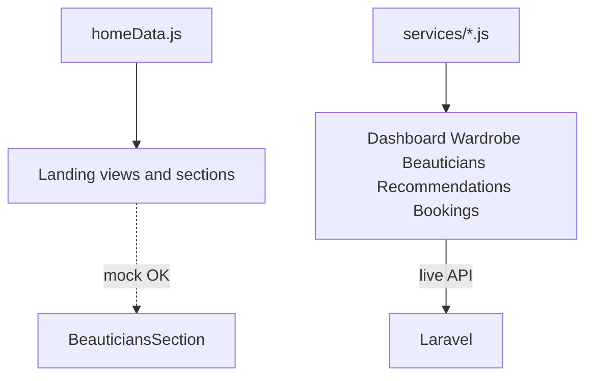

# MakemeupAI Frontend — Dead Code Audit Report

Audit date: 2026-06-03  
Scope: `src/` (Vue 3 + Vite frontend)

---

## 1. Unused file scan

### `src/components/` (10 files)

**SAFE TO DELETE (never imported anywhere):** none

**IN USE:**

| File | Imported in |
|------|-------------|
| `AppHeader.vue` | `src/layouts/LandingLayout.vue` |
| `AppFooter.vue` | `src/layouts/LandingLayout.vue` |
| `BookingModal.vue` | `src/views/BeauticiansView.vue` |
| `BeauticiansSection.vue` | `src/views/HomeView.vue` |
| `FeaturesSection.vue` | `src/views/HomeView.vue`, `src/views/FeaturesView.vue` |
| `HeroSection.vue` | `src/views/HomeView.vue` |
| `HowItWorksSection.vue` | `src/views/HomeView.vue`, `src/views/HowItWorksView.vue` |
| `PricingSection.vue` | `src/views/HomeView.vue`, `src/views/PricingView.vue` |
| `ToastHost.vue` | `src/App.vue` |
| `WardrobeSection.vue` | `src/views/HomeView.vue` |

### `src/views/` (12 files)

**SAFE TO DELETE:** none

**IN USE:** All 12 views are registered in `src/router/index.js`:

- `BeauticiansView.vue`, `BookingsView.vue`, `DashboardView.vue`, `FeaturesView.vue`, `HomeView.vue`, `HowItWorksView.vue`, `NotFoundView.vue`, `PricingView.vue`, `RecommendationsView.vue`, `SignInView.vue`, `SignUpView.vue`, `WardrobeView.vue`

### Supporting modules (referenced)

- `src/layouts/LandingLayout.vue` — used by landing/auth/marketing views
- `src/layouts/DashboardLayout.vue` — used by dashboard, wardrobe, recommendations, bookings
- `src/composables/useToast.js` — used by `ToastHost.vue`, `WardrobeView.vue`, `BeauticiansView.vue`
- `src/stores/auth.js` — used by router, auth views, header, dashboard layout

---

## 2. Static mock data check

**Mock file:** `src/data/homeData.js`

Exports: `navLinks`, `featureCards`, `steps`, `beauticians`, `pricingPlans`

| File | Imports from `homeData` | Usage | Action |
|------|-------------------------|-------|--------|
| `src/layouts/LandingLayout.vue` | `navLinks` | Header navigation links | KEEP |
| `src/views/HomeView.vue` | `beauticians`, `featureCards`, `pricingPlans`, `steps` | Landing page sections | KEEP |
| `src/views/FeaturesView.vue` | `featureCards` | Features section props | KEEP |
| `src/views/HowItWorksView.vue` | `steps` | How-it-works section props | KEEP |
| `src/views/PricingView.vue` | `pricingPlans` | Pricing section props | KEEP |

### Authenticated / API views (should use services, not mock)

| View | Uses `homeData`? | Data source |
|------|------------------|-------------|
| `DashboardView.vue` | No | `getItems()` (`wardrobe.js`), `getMyBookings()` (`bookings.js`) |
| `WardrobeView.vue` | No | `src/services/wardrobe.js` |
| `BeauticiansView.vue` | No | `src/services/beauticians.js` |
| `RecommendationsView.vue` | No | `src/services/recommendations.js` |
| `BookingsView.vue` | No | `src/services/bookings.js` |

**Mock data replaced in views:** none required (authenticated views already use API services).

**Note:** Home page `BeauticiansSection` still shows static `beauticians` from `homeData` while `/beauticians` loads from the API. This matches the rule: landing marketing content may use mock data; the live directory page uses the API.

---

## 3. Duplicate API function check

| File | Exported functions |
|------|-------------------|
| `src/services/api.js` | `getCsrf`, default `api` (axios instance + 401 interceptor) |
| `src/services/beauticians.js` | `getBeauticians`, `getBeautician` |
| `src/services/wardrobe.js` | `getItems`, `addItem`, `deleteItem` |
| `src/services/bookings.js` | `createBooking`, `getMyBookings`, `cancelBooking` |
| `src/services/recommendations.js` | `getRecommendations` |

**Duplicates found:** none. Domain helpers live only in their service files; `api.js` has no overlapping names (e.g. no `getBeauticians` in both `api.js` and `beauticians.js`).

**Removed from `api.js`:** nothing (nothing to remove).

---

## 4. `console.log` cleanup

Searched all `src/**/*.vue` and `src/**/*.js` for `console.log`, `console.debug`, `console.info`, `console.warn`.

| File | Line | Action |
|------|------|--------|
| — | — | No debug logs found |

**Console.logs removed:** 0 in 0 files

Existing error handling uses UI messages/toasts; no `console.error` in catch blocks today (optional future improvement).

---

## 5. Commented-out code blocks

Searched for `//` comment runs, `/* */` blocks, and long HTML comment dead code in `src/`.

| File | Lines | Action |
|------|-------|--------|
| — | — | No dead commented blocks (>3 lines) found |

**Dead code blocks removed:** 0

---

## 6. Package audit

### `npm ls --depth=0` (project root)

```
makemeupai-frontend@0.0.0 C:\Users\huzai\.cursor\projects\empty-window
+-- @vitejs/plugin-vue@5.2.4
+-- autoprefixer@10.5.0
+-- axios@1.16.1
+-- postcss@8.5.12
+-- tailwindcss@3.4.19
+-- vite@5.4.21
+-- vue-router@4.6.4
`-- vue@3.5.33
```

### `dependencies` usage in `src/`

| Package | Imported? | Where |
|---------|-----------|-------|
| `vue` | Yes | `main.js`, views, components, `stores/auth.js`, `composables/useToast.js` |
| `vue-router` | Yes | `router/index.js`, sign-in/up, beauticians, dashboard, layouts |
| `axios` | Yes | `services/api.js` |

**POSSIBLY UNUSED:** none

Build tools in `devDependencies` (`@vitejs/plugin-vue`, `autoprefixer`, `postcss`, `tailwindcss`, `vite`) were not flagged per audit rules.

---

## 7. Summary

| Check | Result |
|-------|--------|
| Files deleted | none |
| Mock data replaced in views | none (authenticated views already use API services) |
| Console.logs removed | 0 in 0 files |
| Dead code blocks removed | 0 |
| Packages to review | none |

### Build verification

`npm run build` — **passed** (1.94s, 112 modules, no errors).

```
dist/index.html                   0.39 kB
dist/assets/index-DyM0cISO.css   20.61 kB
dist/assets/index-sg7T0cBE.js   189.23 kB
```

Vite warnings about dynamic imports in `api.js` (401 interceptor) are expected and not errors.

---

## Architecture (data sources)


