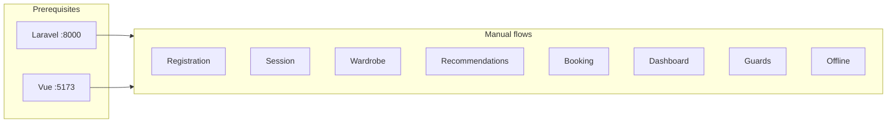

# MakemeupAI Manual Testing Checklist

Manual end-to-end QA for the Vue 3 + Vite frontend against the Laravel 11 API. Run with **both servers** up and use **localhost** hostnames (not `127.0.0.1`) so Sanctum session cookies work.

---

## Prerequisites

| Service | Command | URL |
|---------|---------|-----|
| Laravel API | `cd backend` then `php artisan serve --port=8000` | http://localhost:8000 |
| Vue app | `npm run dev` (project root) | http://localhost:5173 |

**Windows (if `php` is not recognized):**

```powershell
C:\Users\huzai\scoop\shims\php.exe artisan serve --port=8000
```

**Verify API is up:**

```powershell
Invoke-WebRequest -Uri "http://localhost:8000/up" -UseBasicParsing
```

Expect HTTP **200**.

---

## Test session info

| Field | Value |
|-------|-------|
| Date | |
| Tester | |
| Browser | |
| Build / commit | |

---

## FLOW 1 — New User Registration

**Goal:** A new user can register and land on the dashboard with their name visible.

| Step | Action | Expected result | PASS | FAIL | NOTES |
|------|--------|-----------------|------|------|-------|
| 1 | - [ ] Open http://localhost:5173 | Home page loads; header shows **Sign In** / **Get Started** | | | |
| 2 | - [ ] Click **Get Started** (or navigate to **Sign Up**) | `/signup` — **Create Account** form | | | |
| 3 | - [ ] Fill: Name=`Test User`, Email=`test@test.com`, Password=`password123`, Confirm Password=`password123`, City=`Lahore` | All fields accept input | | | |
| 4 | - [ ] Submit the form | Redirect to `/dashboard`; no uncaught errors in browser console | | | |
| 5 | - [ ] Check dashboard greeting | Shows `Good morning/afternoon/evening, Test User` (or similar with **Test User**) | | | |
| 6 | - [ ] **DB check** (terminal): `cd backend` then run:<br>`php artisan tinker --execute="echo App\Models\User::where('email','test@test.com')->exists() ? 'YES' : 'NO';"` | Output **YES** (row in `users` table, SQLite: `database/database.sqlite`) | | | |

> If step 4 fails with duplicate email, use a fresh email or delete the test user before re-running.

---

## FLOW 2 — Session Persistence

**Goal:** Session survives a hard browser refresh after login.

| Step | Action | Expected result | PASS | FAIL | NOTES |
|------|--------|-----------------|------|------|-------|
| 1 | - [ ] From dashboard, click **Sign Out** (sidebar or mobile nav) | Redirect to home `/`; header shows **Sign In** / **Get Started** | | | |
| 2 | - [ ] Go to http://localhost:5173/signin | **Sign In** form loads | | | |
| 3 | - [ ] Log in with `test@test.com` / `password123` | Redirect to `/dashboard` | | | |
| 4 | - [ ] Hard refresh the page (Ctrl+Shift+R) | Still logged in; not sent to `/signin`; dashboard or auth header (**Dashboard →**) still reflects logged-in state | | | |

---

## FLOW 3 — Wardrobe CRUD

**Goal:** Add, filter, and delete wardrobe items without a full page reload.

| Step | Action | Expected result | PASS | FAIL | NOTES |
|------|--------|-----------------|------|------|-------|
| 1 | - [ ] Go to http://localhost:5173/wardrobe | Wardrobe page loads (auth required) | | | |
| 2 | - [ ] Click the floating **+** button (or **Add Item** if wardrobe is empty) | Add-item modal opens | | | |
| 3 | - [ ] Enter: Name=`Blue Kurta`, Category=**Tops**, Colors=`blue`, toggle Season **summer**, toggle Occasion **casual** | Form fields set correctly | | | |
| 4 | - [ ] Click **Add Item** in the modal | Modal closes; **Blue Kurta** appears in the grid without full page reload | | | |
| 5 | - [ ] Click the **Tops** filter tab | Only items with category `tops` are shown | | | |
| 6 | - [ ] Delete **Blue Kurta** (delete control on the card) | Item disappears from the grid | | | |

---

## FLOW 4 — Outfit Recommendation

**Goal:** Recommendations return outfit cards based on wardrobe and occasion.

| Step | Action | Expected result | PASS | FAIL | NOTES |
|------|--------|-----------------|------|------|-------|
| 1 | - [ ] On `/wardrobe`, add 3 items: one **tops**, one **bottoms**, one **shoes** (each with **casual** occasion) | Three items visible in wardrobe | | | |
| 2 | - [ ] Go to http://localhost:5173/recommendations | **Outfit Recommendations** page loads | | | |
| 3 | - [ ] Select occasion pill **Casual** | **Casual** is highlighted | | | |
| 4 | - [ ] Click **Get My Outfit** | Loading state, then up to **3** outfit cards (**Outfit 1**, **Outfit 2**, **Outfit 3**) with item tiles | | | |
| 5 | - [ ] Check weather note | Badge shows temperature (e.g. `°C`), description, and city (e.g. Lahore) | | | |

> If you see *"Add at least 3 items to your wardrobe first"*, ensure each item has **casual** occasion and spans top + bottom + shoes categories.

---

## FLOW 5 — Beautician Booking

**Goal:** Bookings load from the API; guests are prompted to sign in; authenticated users can book and cancel.

| Step | Action | Expected result | PASS | FAIL | NOTES |
|------|--------|-----------------|------|------|-------|
| 1 | - [ ] Go to http://localhost:5173/beauticians | Beautician cards load from API (spinner, then real names/ratings — not static home mock data) | | | |
| 2 | - [ ] **Sign out** if logged in, then click **Book Now** on any card | Toast: *"Please sign in to book"*; after ~1.5s redirect to `/signin` | | | |
| 3 | - [ ] Sign in, return to `/beauticians`, click **Book Now** | Booking modal opens | | | |
| 4 | - [ ] Fill: Service type (e.g. **Makeup Session**), Date=today or future, Time (e.g. `14:00`), optional notes; submit | Toast: **Booking confirmed!**; modal closes | | | |
| 5 | - [ ] Go to http://localhost:5173/bookings | Booking listed with status **pending** | | | |
| 6 | - [ ] Click **Cancel** on that booking; confirm browser dialog | Status changes to **cancelled** | | | |

---

## FLOW 6 — Dashboard

**Goal:** Dashboard reflects wardrobe count and upcoming bookings.

| Step | Action | Expected result | PASS | FAIL | NOTES |
|------|--------|-----------------|------|------|-------|
| 1 | - [ ] Go to http://localhost:5173/dashboard (logged in, with wardrobe items and at least one future booking if possible) | Dashboard loads without error | | | |
| 2 | - [ ] Check **Wardrobe Snapshot** | Item count matches number of items in wardrobe; category breakdown shown if items exist | | | |
| 3 | - [ ] Check **Upcoming Bookings** | Pending/confirmed future bookings visible (up to 2 rows), or *"No bookings yet"* with link to beauticians | | | |

---

## FLOW 7 — Auth Route Guards

**Goal:** Protected routes redirect unauthenticated users to sign-in.

| Step | Action | Expected result | PASS | FAIL | NOTES |
|------|--------|-----------------|------|------|-------|
| 1 | - [ ] **Sign out** | Logged out; public header visible | | | |
| 2 | - [ ] Visit http://localhost:5173/dashboard directly | Redirect to `/signin` | | | |
| 3 | - [ ] Visit http://localhost:5173/wardrobe directly | Redirect to `/signin` | | | |

> Also protected (same guard): `/recommendations`, `/bookings`.

---

## FLOW 8 — Offline Error Handling

**Goal:** API downtime shows a friendly error; app does not crash.

| Step | Action | Expected result | PASS | FAIL | NOTES |
|------|--------|-----------------|------|------|-------|
| 1 | - [ ] Stop the Laravel server (Ctrl+C in the API terminal) | Port 8000 no longer serves requests | | | |
| 2 | - [ ] On http://localhost:5173/signin, submit valid credentials | Inline error message (e.g. *"Unable to sign in. Please try again."* or network error); **no** blank white screen; **no** uncaught errors in DevTools console | | | |
| 3 | - [ ] Restart Laravel: `php artisan serve --port=8000` (or full path to `php.exe`) | Server listening on http://localhost:8000 | | | |
| 4 | - [ ] Sign in again | Login succeeds; redirect to `/dashboard` | | | |

---

## Test run summary

| Metric | Value |
|--------|-------|
| **Flows passed** | ___ / 8 |
| **Blockers** | |
| **Environment notes** | (browser version, PHP version, Node version, anything unusual) |

---

## Quick reference — URLs

| Page | URL |
|------|-----|
| Home | http://localhost:5173/ |
| Features | http://localhost:5173/features |
| How It Works | http://localhost:5173/how-it-works |
| Beauticians | http://localhost:5173/beauticians |
| Pricing | http://localhost:5173/pricing |
| Sign In | http://localhost:5173/signin |
| Sign Up | http://localhost:5173/signup |
| Dashboard | http://localhost:5173/dashboard |
| Wardrobe | http://localhost:5173/wardrobe |
| Recommendations | http://localhost:5173/recommendations |
| Bookings | http://localhost:5173/bookings |

---

## Architecture (test context)


